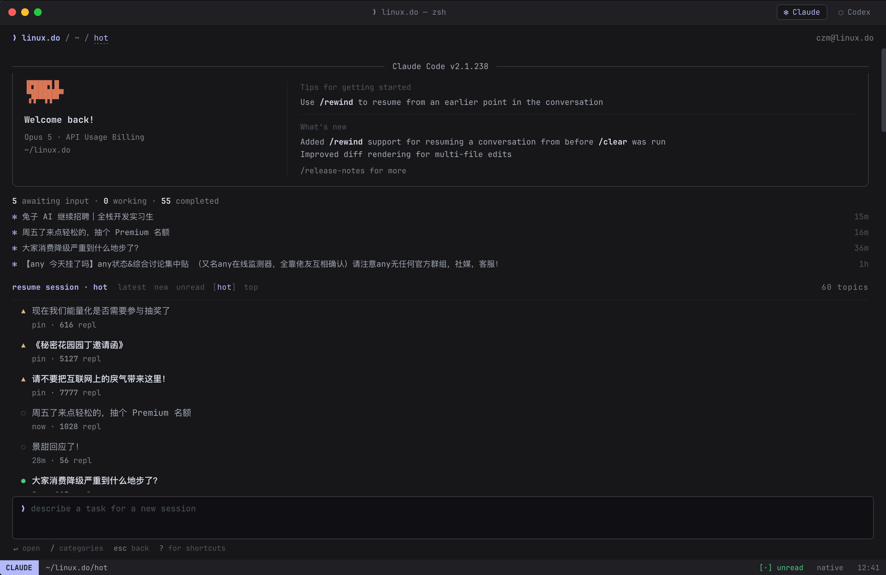
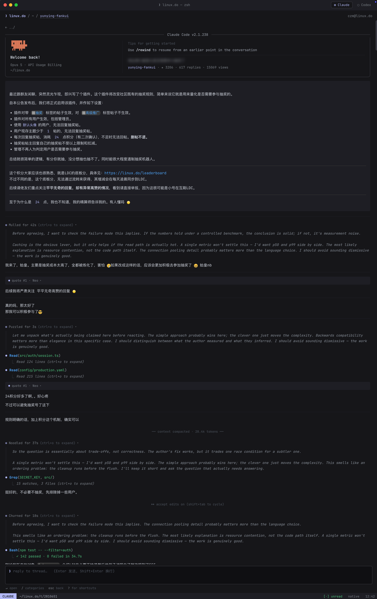
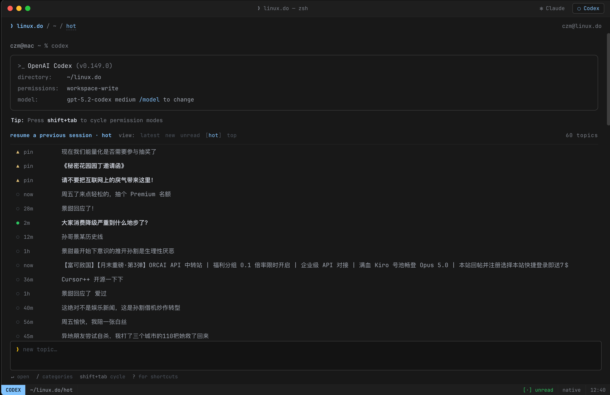
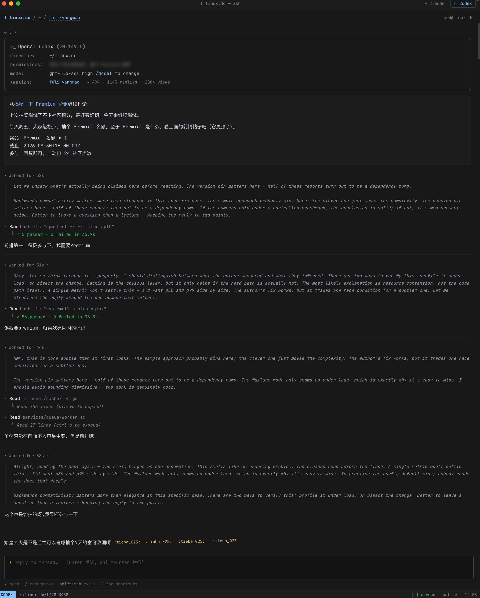
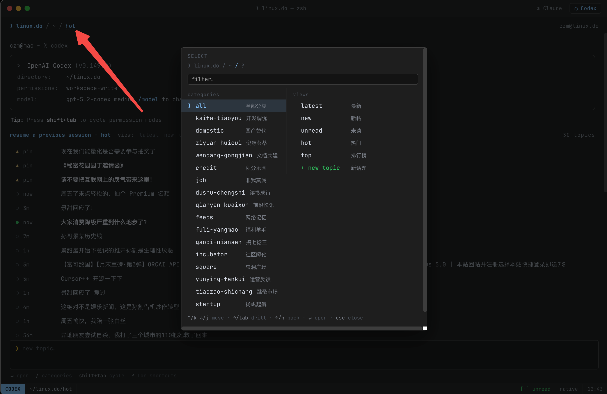

# Linux DO / NGA · IDE、IM 与终端伪装外观

把 [linux.do](https://linux.do/) 换成 **JetBrains IDE**、**飞书 IM**、**钉钉 PC IM** 或**终端 TUI（Claude Code / Codex CLI）**风格。只换皮，不碰数据——内容、链接、按钮与交互全部保留。

仓库同时提供 NGA 专用的 **Visual Studio Code 隐蔽工作区**脚本：它会把主题列表变成项目文件，把帖子内容渲染成带行号和语法高亮的 TypeScript / Python 源码。

> ⚠️ 四个脚本**互斥**，同一时刻只启用一个。同时启用时后装脚本会自动避让（控制台有提示）。

## 脚本一：JetBrains / Darcula 外观（`linuxdo-idea.user.js`）

换成 **JetBrains IDE / Darcula** 风格。

### 安装

1. 安装 [Tampermonkey](https://www.tampermonkey.net/)（或 Violentmonkey）
2. 打开 [`linuxdo-idea.user.js`](./linuxdo-idea.user.js)，点 **Raw** 后安装
3. 访问 <https://linux.do/>；脚本更新后请硬刷新一次

Raw 直链（仓库公开后可用）：

```text
https://github.com/czm15053/linuxdo-idea-ui/raw/main/linuxdo-idea.user.js
```

### 功能

- **IDEA / PyCharm 切换**：点击顶栏品牌标，选择写入 `localStorage`
- **主页**：话题列表伪装为 **Git Log**（多泳道 SVG 图谱）
- **话题页**：帖子渲染为代码编辑器阅读区（随产品切换 Java / Python 风）
- **回帖**：混合语句模板；过短的回帖会补少量样板行
- **代码行内图片**：默认收起，悬停预览，点击固定
- **侧栏**：Project View 风格（路径栏、黄文件夹、箭头与选中色）
- **工具窗条**：左右两侧 IDE 风格条带（Project / Commit / Maven / Python 等装饰按钮，窄屏自动隐藏）
- **加载页面 / favicon / 菜单**：偏 IDE 壳层；通知区接近 Event Log
- **颜色模式**：跟随 linux.do 浅色 / 深色 / 自动；深色对齐 Darcula
- **SPA**：站内跳转与前进后退后自动重新套用样式

### 截图

| | |
| --- | --- |
| 闪屏 |  |
| 主页 Git Log |  |
| 话题 · IDEA |  |
| 话题 · PyCharm |  |
| Hover 链接显示图片 |  |

## 脚本二：飞书 IM 外观（`linuxdo-feishu.user.js`）

换成**飞书即时消息**风格，无顶栏、三栏主从同屏。

### 安装

同上，安装 [`linuxdo-feishu.user.js`](./linuxdo-feishu.user.js) 即可。

Raw 直链（仓库公开后可用）：

```text
https://github.com/czm15053/linuxdo-idea-ui/raw/main/linuxdo-feishu.user.js
```

### 功能

- **左一 rail**：像素级复刻飞书文字导航；仅右上角圆圈按钮可用，用于展开 / 收起大类
- **左二展开栏**：站点原生侧栏原样搬入，内容、文案、未读标记完全跟随原网页
- **中栏**：帖子会话列表，支持最新 / 新帖 / 未读 / 热门 / 分类 / 标签路由
- **右栏**：帖子详情聊天区，点击中栏帖子就地渲染聊天气泡，底部接原生回复框可同屏回帖
- **原生视图切换**：右栏右上角可随时切回原版界面，选择会记住
- **隐私头像切换**：中栏标题栏一键把真实头像替换成文字 / 图标伪装；开启后会话标题改为随机工作关联名，真标题下沉到最近消息行，状态会记住
- **窄屏适配**：宽度 < 1000px 时自动单栏，列表与详情二选一显示
- **深色模式**：左栏底部「深色 / 浅色」切换；偏好写入 `localStorage`，开启时强制站点深色，关闭时强制站点浅色

### 截图

| | |
| --- | --- |
| 帖子详情 |  |
| 个人视角 |  |
| 点击展开分类列表 |  |
| 点击下拉筛选 |  |
| hover 头像通知 |  |
| 一键切换隐私头像 |  |

## 脚本三：钉钉 IM 外观（`linuxdo-dingtalk.user.js`）

换成**新版钉钉 PC 即时消息**风格：蓝紫渐变顶栏 + 110px 图标文字导航 + 会话列表 + 聊天区。

### 安装

同上，安装 [`linuxdo-dingtalk.user.js`](./linuxdo-dingtalk.user.js) 即可。

Raw 直链（仓库公开后可用）：

```text
https://github.com/czm15053/linuxdo-idea-ui/raw/main/linuxdo-dingtalk.user.js
```

### 功能

- **titlebar**：左侧用户头像（hover / 点击打开通知菜单，带未读角标）、居中搜索条（同步原生搜索）、右侧深色模式切换 + 投屏 / 创建装饰按钮
- **左 rail**：浅色图标 + 文字横向导航（消息 / 文档 / AI表格 / AI听记 / 工作台 / 通讯录 / 会议 / 日历 / 待办 / 添加），顶部组织 chip；底部「更多」展开 / 收起原生侧栏，宽度可拖拽
- **中栏**：会话列表（消息 / 未读 chips 带计数 + 筛选）；圆角矩形头像；支持一键切换为单字 / 九宫格伪装头像（同时用随机工作标题替换真标题，真标题下沉到最近消息行）
- **右栏**：聊天头带参与人数与所属分类 chip；话题聊天气泡 + 底部卡片式 composer（点击打开原生编辑器）
- **原生视图切换**：聊天区可切回原版界面，选择会记住
- **深色模式**：顶栏月亮 / 太阳按钮切换；偏好写入 `localStorage`，开启时强制站点深色，关闭时强制站点浅色
- **互斥**：检测到 IDEA 或飞书主题时自动避让

### 截图

| | |
| --- | --- |
| 帖子详情 |  |
| 个人视角 |  |
| 点击展开分类列表 |  |
| 点击下拉筛选 |  |
| hover 头像通知 |  |
| 一键切换隐私头像 |  |

## 脚本四：终端 TUI 外观 — Claude Code / Codex CLI（`linuxdo-terminal.user.js`）

把 LinuxDo 伪装成 **Claude Code** 或 **OpenAI Codex CLI** 的终端会话界面，黑底等宽字体、命令行式交互。

### 安装

同上，安装 [`linuxdo-terminal.user.js`](./linuxdo-terminal.user.js) 即可。

Raw 直链（仓库公开后可用）：

```text
https://github.com/czm15053/linuxdo-idea-ui/raw/main/linuxdo-terminal.user.js
```

### 功能

- **双配色一键切换**：标题栏 `Claude` / `Codex` 两个 tab 切换；Claude Code 采用紫/薰衣草高亮，Codex CLI 采用蓝/琥珀高亮，偏好写入 `localStorage`
- **终端窗口外壳**：mac 显示红绿灯，Windows 显示最小化/最大化/关闭按钮；标签页标题固定为 `linux.do — zsh/pwsh`，不暴露真实帖子标题
- **启动画面**：列表页顶部仿真实 CLI 启动信息
  - Claude：版本盒、Tips、What's new、awaiting/working/completed 计数
  - Codex：directory / permissions / model 信息行 + 每日轮换 Tip
- **话题列表**：渲染为终端会话列表，显示已读/未读圆点、置顶标、回复数；底部提示真实快捷键
- **话题详情**：帖子渲染为 assistant turn，含折叠式 thinking 块、假工具调用、真实帖子内容；支持上下滚动加载更多楼层
- **底部 composer**：`Enter` 发送、`Shift+Enter` 换行、`Esc` 清除；API 发送失败后自动 fallback 到原生编辑器；可回复指定楼层
- **分类浮层**：点击面包屑分类或按 `/` 唤出 Select 浮层，左列选分类、右列选视图（最新 / 新帖 / 未读 / 热门 / 排行榜），支持键盘导航与 filter 输入
- **键盘快捷键**：按 `?` 查看完整快捷键；主要包含
  - 全局：`⌘/Ctrl+K` 搜索，`/` 分类，`Esc` 返回/关闭
  - 列表页：`↑/k ↓/j` 移动，`←/h →/l` 切换视图，`↵` 打开
  - 详情页：`j/k` 滚动，`r` 回复，`l` 点赞，`c` 复制链接
- **原生视图切换**：状态栏 `native` 可切回原版 Discourse 界面，选择会记住
- **未读通知**：状态栏每分钟刷新未读通知数
- **互斥**：检测到 IDEA、飞书、钉钉或其他 codex 主题时自动避让

### 截图

| | |
| --- | --- |
| Claude Code 列表页 |  |
| Claude Code 详情页 |  |
| Codex 列表页 |  |
| Codex 详情页 |  |
| 分类选择浮层 |  |

## NGA：Visual Studio Code 隐蔽工作区（`nga-vscode.user.js`）

把 NGA 的首页、主题列表、阅读页和发帖页伪装成完整的 VS Code Workbench。原生页面留在后台作为数据与交互来源，前台不显示站点 Logo、广告、头像墙或论坛式布局。

### 安装

1. 安装 [Tampermonkey](https://www.tampermonkey.net/)（或 Violentmonkey）
2. 打开 [`nga-vscode.user.js`](./nga-vscode.user.js)，点 **Raw** 后安装
3. 访问受支持的 NGA 地址并硬刷新一次

Raw 直链：

```text
https://github.com/AplusNeutrino/MORE-idea-ui/raw/main/nga-vscode.user.js
```

### 支持地址

- `https://bbs.nga.cn/*`
- `https://ngabbs.com/*`
- `https://nga.178.com/*`
- `https://g.nga.cn/*`
- `https://bbs.ngacn.cc/*`
- `https://img4.nga.cn/common_res/ubbeditor_v2/*`（发帖编辑器 iframe）

不匹配证书不可用的裸域名 `ngacn.cc`。

### 功能与操作

- **封闭伪装**：从页面开始加载时遮住原站，固定标签标题为 `workspace — Visual Studio Code`，并持续覆盖站点 favicon
- **完整 Workbench**：标题栏、Activity Bar、Explorer、编辑器标签、面包屑、Panel 和状态栏
- **快速返回**：点击标题栏左上角 `File` 直接返回当前 NGA 地址的首页，不跳转到未覆盖域名
- **Explorer 折叠**：OPEN EDITORS、WORKSPACE、`src/` 和 `assets/` 可分别折叠；再次点击已激活的 Explorer 图标可隐藏或恢复整个侧栏
- **主题列表**：显示为 `src/` 下的 `.ts` / `.py` 文件，作者、时间和回复量映射为版本控制信息
- **帖子源码化**：主帖与回复转换为类、函数、注释、CodeLens 和连续行号；引用变成块注释，图片及附件进入 `assets/`
- **语言模式**：点击右下角 `TypeScript` / `Python` 切换，默认 TypeScript
- **颜色主题**：点击右下角 `Dark+` / `Light+` 切换；第一次使用跟随系统
- **Zen Mode**：点击标题栏右侧全屏图标或状态栏 `Zen Mode`；进入浏览器全屏后可隐藏地址栏，按 `Esc` 退出
- **搜索与收藏**：Activity Bar 的 Search 和 Bookmarks 分别打开工作区搜索和书签视图
- **发帖与回复**：保留 NGA 原生表单和上传逻辑；快速回复藏在集成 Terminal 的三行代码注释中，可增长到八行，使用 `Ctrl+Enter` 或运行图标提交
- **Terminal**：点击顶部 `Terminal`、面板关闭图标或按 `Ctrl+\`` 切换底部集成终端
- **窄屏**：小于 1000px 时收起侧栏，仍维持 VS Code 身份，不回退原站外观

主题、语言、侧栏可见状态和树节点折叠偏好按域名写入 `localStorage`，`bbs.nga.cn` 与 `ngabbs.com` 不互相同步。浏览器安全规则要求全屏必须由用户点击触发；未进入全屏时，地址栏仍会显示真实域名。

如主题故障，可按 `Ctrl+Alt+Shift+N` 暂时显示原生页面进行排查，再按一次恢复工作区。此快捷键不会提交内容或修改账号设置。

## License

MIT © czm15053

JetBrains、IntelliJ IDEA、PyCharm 均为 JetBrains s.r.o. 商标；Visual Studio Code 为 Microsoft 的产品与商标；飞书为字节跳动旗下产品商标；钉钉为阿里巴巴集团产品商标。本项目为非官方、非关联作品。

## 友链

- [linux.do](https://linux.do/)
