# Linux DO · JetBrains / 飞书 / 钉钉 风格外观

把 [linux.do](https://linux.do/) 换成 **JetBrains IDE**、**飞书 IM** 或**钉钉 PC IM** 风格。只换皮，不碰数据——内容、链接、按钮与交互全部保留。

> ⚠️ 三个脚本**互斥**，同一时刻只启用一个。同时启用时后装脚本会自动避让（控制台有提示）。

## 脚本一：JetBrains / Darcula 外观（`linuxdo-idea.user.js`）

换成 **JetBrains IDE / Darcula** 风格。

### 安装

1. 安装 [Tampermonkey](https://www.tampermonkey.net/)（或 Violentmonkey）
2. 打开 [`linuxdo-idea.user.js`](./linuxdo-idea.user.js)，点 **Raw** 后安装
3. 访问 <https://linux.do/>；脚本更新后请硬刷新一次

Raw 直链（仓库公开后可用）：

```text
https://github.com/czm15053/linuxdo-idea-ui/raw/main/linuxdo-idea.user.js
```

### 功能

- **IDEA / PyCharm 切换**：点击顶栏品牌标，选择写入 `localStorage`
- **主页**：话题列表伪装为 **Git Log**（多泳道 SVG 图谱）
- **话题页**：帖子渲染为代码编辑器阅读区（随产品切换 Java / Python 风）
- **回帖**：混合语句模板；过短的回帖会补少量样板行
- **代码行内图片**：默认收起，悬停预览，点击固定
- **侧栏**：Project View 风格（路径栏、黄文件夹、箭头与选中色）
- **工具窗条**：左右两侧 IDE 风格条带（Project / Commit / Maven / Python 等装饰按钮，窄屏自动隐藏）
- **加载页面 / favicon / 菜单**：偏 IDE 壳层；通知区接近 Event Log
- **颜色模式**：跟随 linux.do 浅色 / 深色 / 自动；深色对齐 Darcula
- **SPA**：站内跳转与前进后退后自动重新套用样式

### 截图

| | |
| --- | --- |
| 闪屏 | 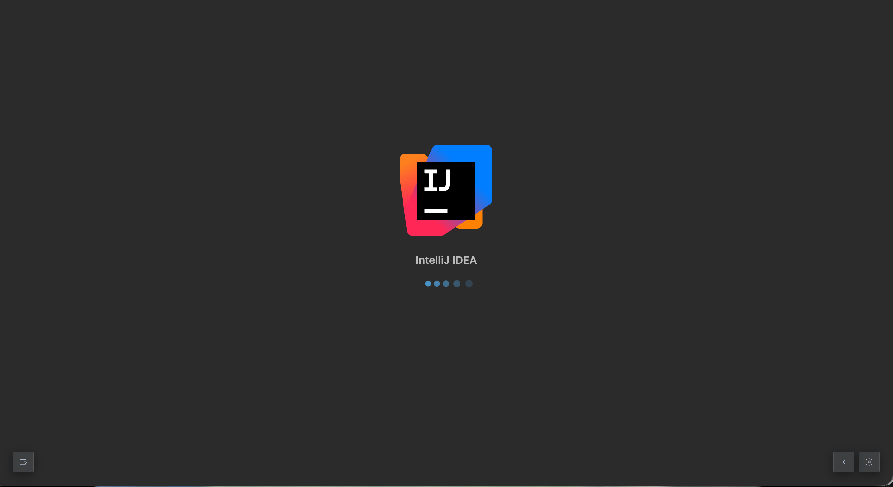 |
| 主页 Git Log | 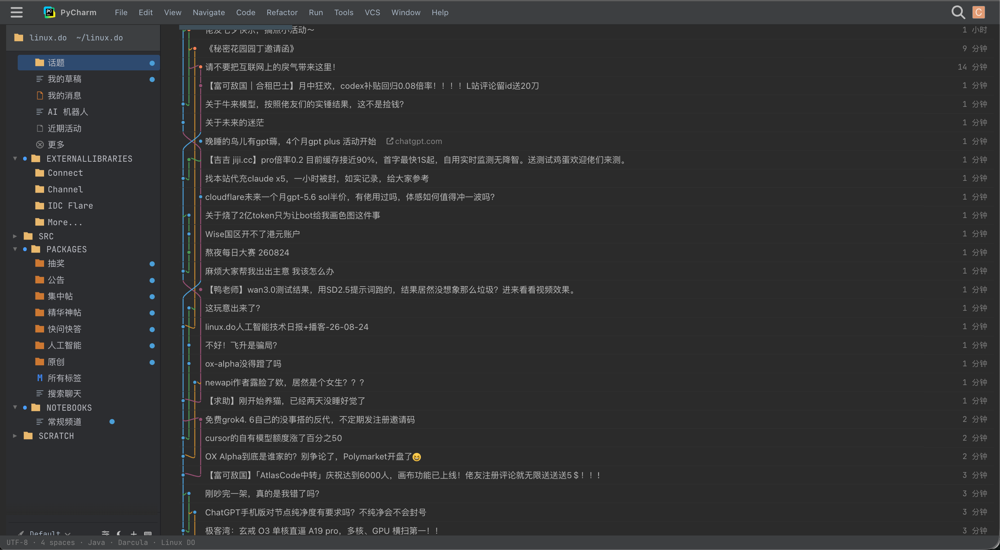 |
| 话题 · IDEA |  |
| 话题 · PyCharm | 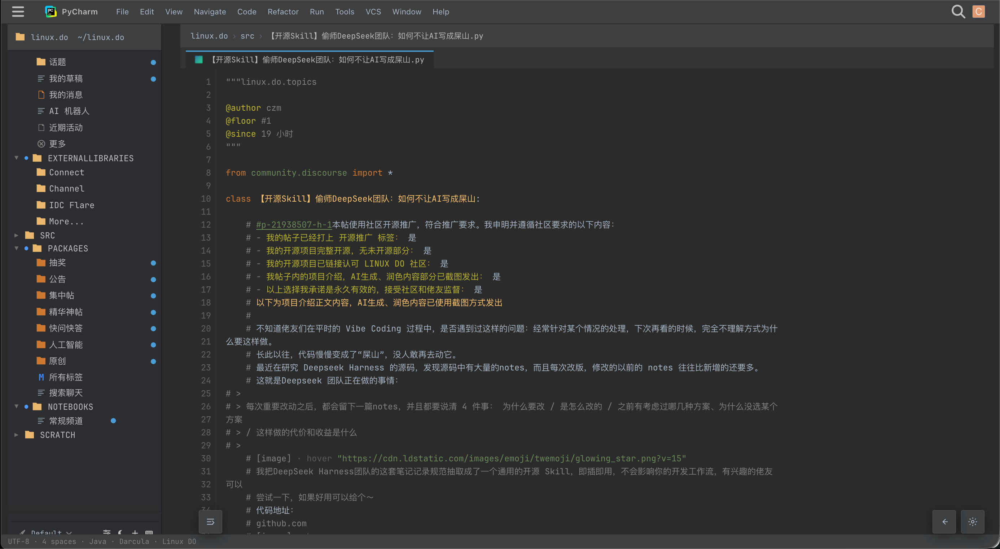 |
| Hover 链接显示图片 | 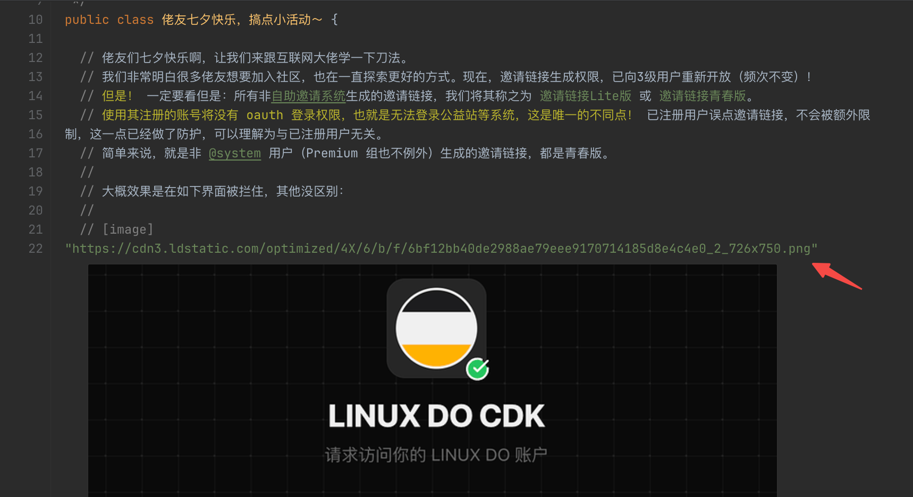 |

## 脚本二：飞书 IM 外观（`linuxdo-feishu.user.js`）

换成**飞书即时消息**风格，无顶栏、三栏主从同屏。

### 安装

同上，安装 [`linuxdo-feishu.user.js`](./linuxdo-feishu.user.js) 即可。

Raw 直链（仓库公开后可用）：

```text
https://github.com/czm15053/linuxdo-idea-ui/raw/main/linuxdo-feishu.user.js
```

### 功能

- **左一 rail**：像素级复刻飞书文字导航；仅右上角圆圈按钮可用，用于展开 / 收起大类
- **左二展开栏**：站点原生侧栏原样搬入，内容、文案、未读标记完全跟随原网页
- **中栏**：帖子会话列表，支持最新 / 新帖 / 未读 / 热门 / 分类 / 标签路由
- **右栏**：帖子详情聊天区，点击中栏帖子就地渲染聊天气泡，底部接原生回复框可同屏回帖
- **原生视图切换**：右栏右上角可随时切回原版界面，选择会记住
- **隐私头像切换**：中栏标题栏一键把真实头像替换成文字 / 图标伪装；开启后会话标题改为随机工作关联名，真标题下沉到最近消息行，状态会记住
- **窄屏适配**：宽度 < 1000px 时自动单栏，列表与详情二选一显示
- **深色模式**：左栏底部「深色 / 浅色」切换；偏好写入 `localStorage`，开启时强制站点深色，关闭时强制站点浅色

### 截图

| | |
| --- | --- |
| 帖子详情 | 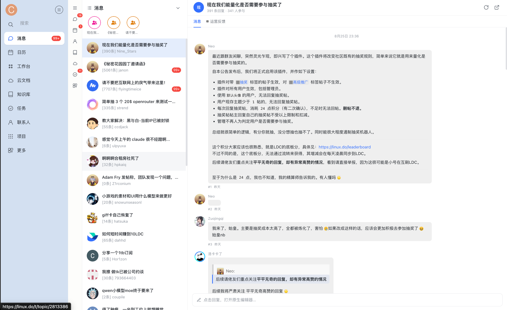 |
| 个人视角 | 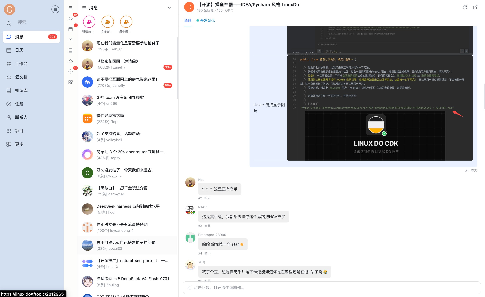 |
| 点击展开分类列表 | 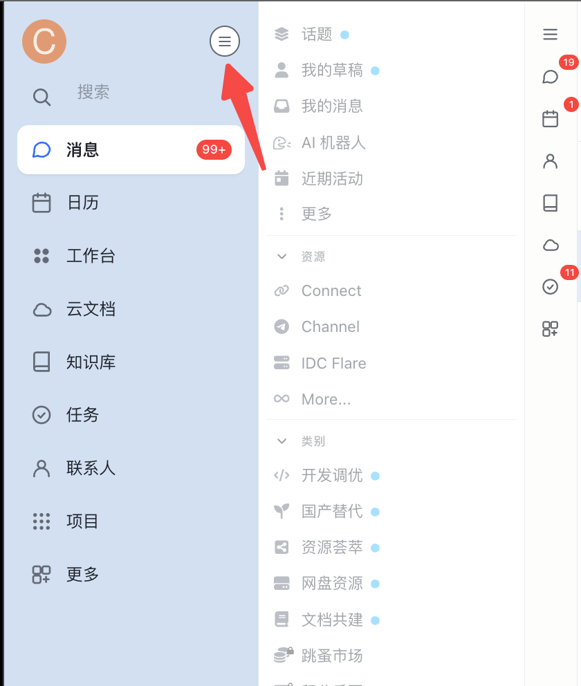 |
| 点击下拉筛选 |  |
| hover 头像通知 |  |
| 一键切换隐私头像 | 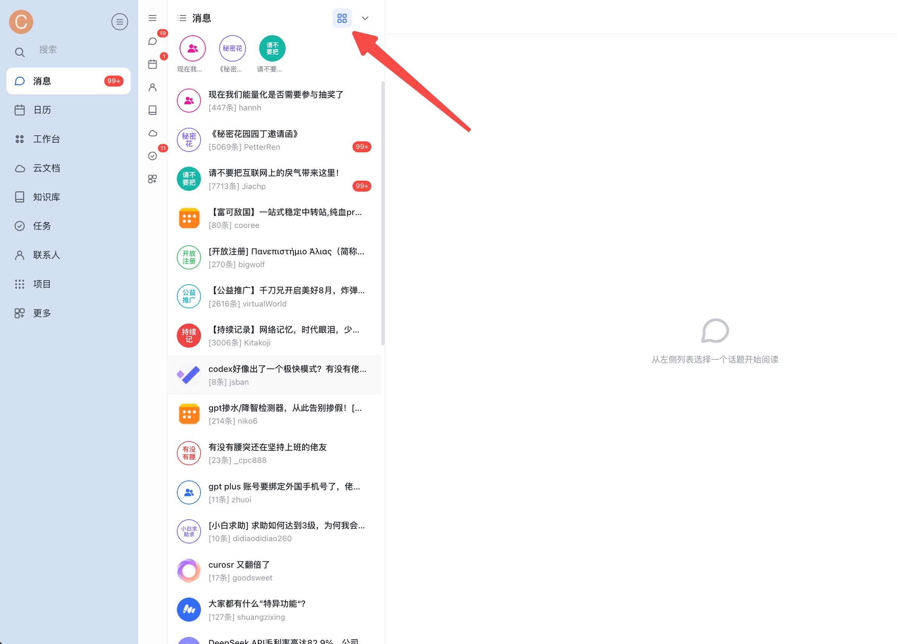 |

## 脚本三：钉钉 IM 外观（`linuxdo-dingtalk.user.js`）

换成**新版钉钉 PC 即时消息**风格：蓝紫渐变顶栏 + 110px 图标文字导航 + 会话列表 + 聊天区。

### 安装

同上，安装 [`linuxdo-dingtalk.user.js`](./linuxdo-dingtalk.user.js) 即可。

Raw 直链（仓库公开后可用）：

```text
https://github.com/czm15053/linuxdo-idea-ui/raw/main/linuxdo-dingtalk.user.js
```

### 功能

- **titlebar**：左侧用户头像（hover / 点击打开通知菜单，带未读角标）、居中搜索条（同步原生搜索）、右侧深色模式切换 + 投屏 / 创建装饰按钮
- **左 rail**：浅色图标 + 文字横向导航（消息 / 文档 / AI表格 / AI听记 / 工作台 / 通讯录 / 会议 / 日历 / 待办 / 添加），顶部组织 chip；底部「更多」展开 / 收起原生侧栏，宽度可拖拽
- **中栏**：会话列表（消息 / 未读 chips 带计数 + 筛选）；圆角矩形头像；支持一键切换为单字 / 九宫格伪装头像（同时用随机工作标题替换真标题，真标题下沉到最近消息行）
- **右栏**：聊天头带参与人数与所属分类 chip；话题聊天气泡 + 底部卡片式 composer（点击打开原生编辑器）
- **原生视图切换**：聊天区可切回原版界面，选择会记住
- **深色模式**：顶栏月亮 / 太阳按钮切换；偏好写入 `localStorage`，开启时强制站点深色，关闭时强制站点浅色
- **互斥**：检测到 IDEA 或飞书主题时自动避让

### 截图

| | |
| --- | --- |
| 帖子详情 | 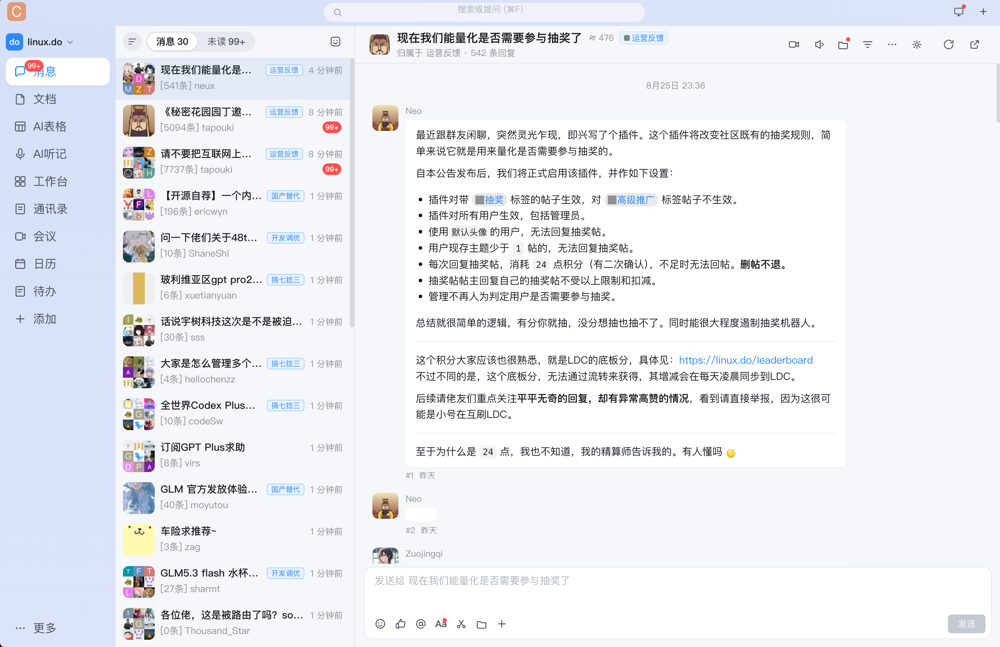 |
| 个人视角 | 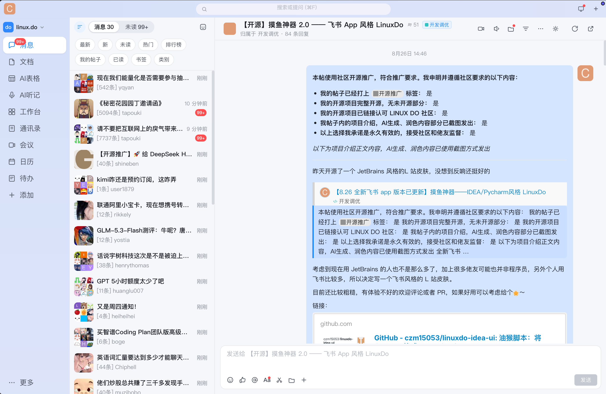 |
| 点击展开分类列表 | 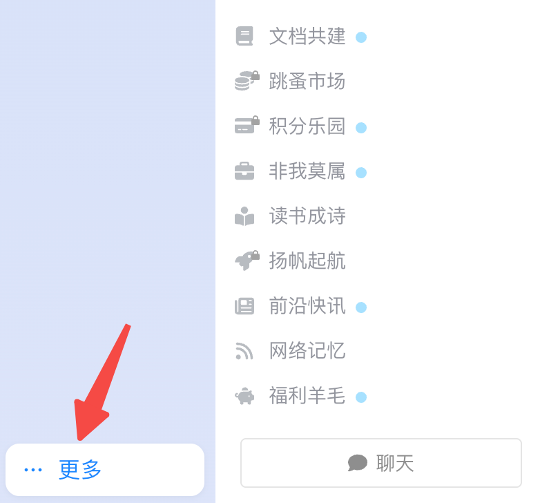 |
| 点击下拉筛选 |  |
| hover 头像通知 |  |
| 一键切换隐私头像 | 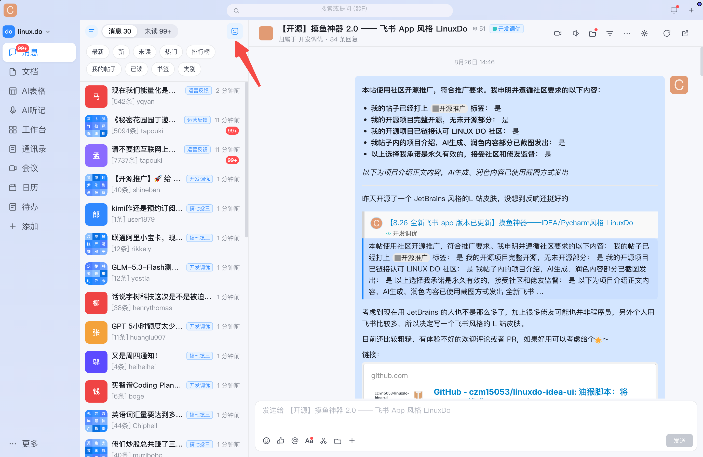 |

## License

MIT © czm15053

JetBrains、IntelliJ IDEA、PyCharm 均为 JetBrains s.r.o. 商标；飞书为字节跳动旗下产品商标；钉钉为阿里巴巴集团产品商标。本项目为非官方、非关联作品。

## 友链

- [linux.do](https://linux.do/)
